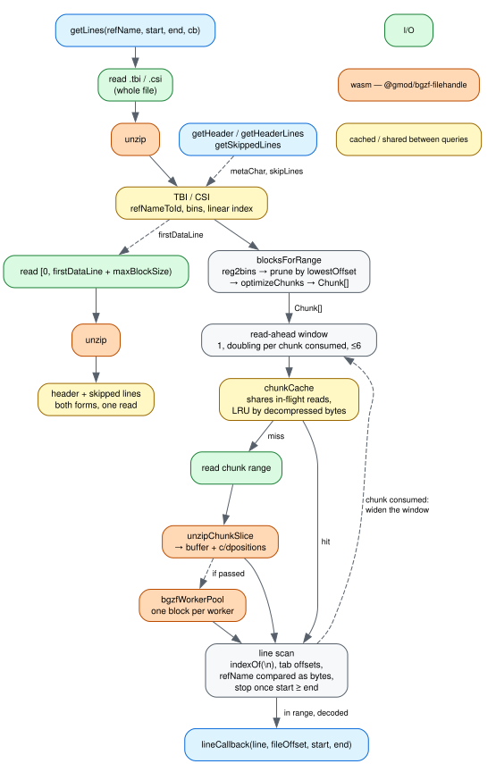

# @gmod/tabix

[](https://npmjs.org/package/@gmod/tabix)


Read Tabix-indexed files using either .tbi or .csi indexes.

## Install

```bash
npm install @gmod/tabix
```

## Usage

```typescript
import { TabixIndexedFile } from '@gmod/tabix'

// Local file — TBI index assumed at path + '.tbi'
const file = new TabixIndexedFile({ path: 'file.vcf.gz' })

// CSI index
const csi = new TabixIndexedFile({
  path: 'file.vcf.gz',
  csiPath: 'file.vcf.gz.csi',
})

// Remote files
const remote = new TabixIndexedFile({
  url: 'https://example.com/file.vcf.gz',
  tbiUrl: 'https://example.com/file.vcf.gz.tbi',
})

// Or with a filehandle from generic-filehandle2
import { RemoteFile } from 'generic-filehandle2'

const custom = new TabixIndexedFile({
  filehandle: new RemoteFile('https://example.com/file.vcf.gz'),
  tbiFilehandle: new RemoteFile('https://example.com/file.vcf.gz.tbi'),
})
```

### getLines

Fetches lines overlapping a region. `start`/`end` are 0-based half-open
coordinates (unlike the tabix CLI which uses 1-based closed).

```typescript
const lines: string[] = []
await file.getLines('chr1', 200, 300, line => lines.push(line))
```

The callback also receives the virtual file offset and parsed coordinates for
the line:

```typescript
await file.getLines('chr1', 200, 300, (line, fileOffset, start, end) => {
  lines.push(line)
})
```

Pass an options object instead of a bare callback to abort the query or track
download progress:

```typescript
const aborter = new AbortController()
await file.getLines('chr1', 200, 300, {
  lineCallback: (line, fileOffset, start, end) => lines.push(line),
  signal: aborter.signal,
  onProgress: (bytesDownloaded, totalBytes) => {
    console.log(`${bytesDownloaded}/${totalBytes}`)
  },
})
```

`onProgress` ticks once per compressed block, including instant ticks for cache
hits, and `totalBytes` is known up front from the index — enough for a
determinate progress bar.

Notes:

- Meta/comment lines are skipped
- Line strings have no trailing whitespace
- Pass `undefined` for `end` to read to the end of the contig
- A `refName` that is not in the index yields no lines and no error, so a
  `chr1`/`1` naming mismatch looks like an empty region. Check against
  [`getReferenceSequenceNames`](#getreferencesequencenamesopts-promisestring) if
  a query comes back unexpectedly empty
- `start > end` throws a `TypeError`; `start === end` returns without reading

### Without NPM (CDN)

```html
<script src="https://unpkg.com/@gmod/tabix/dist/tabix-bundle.js"></script>
```

See [example/index.html](example/index.html) for a working demo. It fetches the
VCF over HTTP, so serve the directory (e.g. `npx serve example`) rather than
opening the file directly.

## API

### `new TabixIndexedFile(args)`

| Arg                       | Type                 | Description                                                                                                                                                                                                                                   |
| ------------------------- | -------------------- | --------------------------------------------------------------------------------------------------------------------------------------------------------------------------------------------------------------------------------------------- |
| `path`                    | `string?`            | Local file path                                                                                                                                                                                                                               |
| `url`                     | `string?`            | Remote URL                                                                                                                                                                                                                                    |
| `filehandle`              | `GenericFilehandle?` | Custom filehandle (from [generic-filehandle2](https://github.com/GMOD/generic-filehandle2))                                                                                                                                                   |
| `tbiPath`                 | `string?`            | TBI index path (defaults to `path + '.tbi'`)                                                                                                                                                                                                  |
| `tbiUrl`                  | `string?`            | TBI index URL                                                                                                                                                                                                                                 |
| `tbiFilehandle`           | `GenericFilehandle?` | TBI index filehandle                                                                                                                                                                                                                          |
| `csiPath`                 | `string?`            | CSI index path                                                                                                                                                                                                                                |
| `csiUrl`                  | `string?`            | CSI index URL                                                                                                                                                                                                                                 |
| `csiFilehandle`           | `GenericFilehandle?` | CSI index filehandle                                                                                                                                                                                                                          |
| `chunkCacheSize`          | `number?`            | Chunk LRU cache budget, in _decompressed_ bytes (default 1 GiB). A retention bound, not a bound on peak memory. Size it to hold several queries: below one query's working set the hit rate drops to zero while the memory is retained anyway |
| `chunkCacheIdleTimeoutMs` | `number?`            | Drop a cached chunk once nothing has read it for this long (default 3 minutes, `0` disables). The only thing that lowers the cache while nothing is happening, and what makes the budget above a peak rather than a resting level             |

### `getLines(refName, start, end, opts)`

Calls the line callback for each line overlapping `[start, end)`. `start`
defaults to `0` and `end` to the end of the contig when `undefined`. `opts` is
either the callback itself or an object:

| Option         | Type                                                     | Description                             |
| -------------- | -------------------------------------------------------- | --------------------------------------- |
| `lineCallback` | `(line, fileOffset, start, end) => void`                 | Required                                |
| `signal`       | `AbortSignal?`                                           | Aborts the in-flight reads              |
| `onProgress`   | `(bytesDownloaded: number, totalBytes?: number) => void` | Called as compressed blocks are fetched |

### `getHeader(opts?): Promise<string>`

Returns all comment/meta lines before the first data line as a string, matching
what `tabix -H` prints. A header row that is not commented is therefore not
included, even when the index counted it as a line to skip — see
`getSkippedLines`.

### `getHeaderBuffer(opts?): Promise<Uint8Array>`

Returns the header as raw bytes.

### `getSkippedLines(opts?): Promise<string[]>`

Returns the leading lines the index says to skip (`tabix -S N`), or `[]` when it
records none. This is where a file whose header row is not commented keeps it,
which PLINK `.ld`, bedGraph and BED deflines routinely are.

Separate from `getHeader` because htslib treats the two differently: a line is
not data when the index's skip count covers it **or** it starts with the meta
character, but `tabix -H` prints only the latter.

### `getHeaderLines(opts?): Promise<string[]>`

Returns the file's header lines however the file keeps them: the commented block
when there is one, and otherwise the rows the index counted. Empty lines are
dropped.

This is usually the one you want. Reading `getHeader` alone cannot tell a file
that has no header from one whose header is not commented — both come back as
the empty string — so callers fall back to an assumed column layout and quietly
mis-name columns. Both forms are parsed from a single read of the file's leading
blocks, which is also shared with `getHeader` and `getSkippedLines`.

### `getReferenceSequenceNames(opts?): Promise<string[]>`

Returns reference sequence names in index order.

### `lineCount(refName, opts?): Promise<number>`

Returns the number of data lines on the given reference, or `-1` if the
reference is not in the index.

### `bytesForRegions(regions, opts?): Promise<number>`

Estimates the compressed byte size of index chunks covering the given regions.
Useful for deciding whether a request is too large before calling `getLines`.

## How a query flows



`getLines` turns a region into a list of BGZF chunks through the index, reads
each chunk through `chunkCache`, and scans the decompressed bytes for lines,
handing the ones that overlap the region to your callback. The header path is
separate — `getLines` never reads it. ([docs/dataflow.dot](docs/dataflow.dot) is
the source; regenerate with `dot -Tsvg docs/dataflow.dot -o docs/dataflow.svg`.)

Everything orange is wasm, in
[`@gmod/bgzf-filehandle`](https://github.com/GMOD/bgzf-filehandle), and it is
only ever inflate. Both `.tbi` and `.csi` are bgzip-compressed, so unlike
`@gmod/bam` — where a `.bai` is raw bytes — every index read here goes through
it too.

### The optimizations

Most of what follows exists because a query is dominated by two things: network
round trips, and inflating more bytes than the answer needs.

**The index is parsed once and shared.** `.tbi`/`.csi` is a whole-file read,
inflated and parsed on the first query and memoized for the life of the object.
It is shared rather than merely memoized: the parse runs under a signal of its
own and is cancelled only once every caller waiting on it has given up, so a
query that pans away cannot abort the index read that concurrent queries are
depending on. `getIndices(refId)` is separately LRU-memoized so repeated lookups
don't re-walk the parsed bytes.

**The index parse allocates once, not per entry.** Finding the minimum virtual
offset visits every linear-index entry in the file — 301k of them on
`test/data/failing_tabix.vcf.gz.tbi`, against 19k bin chunks — so
`minVirtualOffset` compares packed offsets in place and allocates at most one
`VirtualOffset` instead of one per entry.

**Chunks are pruned, merged and clamped before anything is fetched.**
`blocksForRange` collects a chunk per overlapping bin at every level, which is
far more than a query reads. `optimizeChunks` drops chunks ending at or before
the linear-index floor _before_ sorting, merges neighbours within 65KB (up to a
5MB span) so adjacent bins become one range request, and trims overlaps so no
byte is fetched twice. `clampChunkEnds` then pulls each chunk's end down to the
next known BGZF block boundary rather than over-reading a full maximum-size
block — smaller fetches and a smaller `bytesForRegions` estimate, with no extra
I/O.

**Read-ahead is earned, not fixed.** Every chunk is its own range request, so a
long scan pays a round trip per chunk serially — 22 in a row for a 1Mb window on
`1kg.chr1`. But a sparse file offers chunks the scan never reaches, and
prefetching those multiplies the bytes for nothing. So the window starts at one
and doubles each time a chunk is consumed without the scan ending: a query that
stops inside its first chunk issues exactly the reads a sequential scan would,
and a long one reaches the 6-chunk cap after three. Six because that is the
HTTP/1.1 per-host connection limit browsers enforce.

**The scan stops as soon as it is past the region.** Lines are in coordinate
order, so the first line with `start >= end` ends the whole query, not just the
chunk.

**Lines are matched as bytes, and only decoded if they match.** The reference
name is compared byte-for-byte against the encoded query name, coordinates are
parsed straight out of the buffer, and `TextDecoder` runs only on lines that
survive the range test. Tab offsets go into one reused `Int32Array`. For VCF,
`END=` and `SVTYPE=TRA` are found in a single pass over the INFO field rather
than by repeated `indexOf` for bytes that produce many false positives.

The scanning itself deliberately uses `Uint8Array.indexOf` even though the scans
overlap and a hand-written single pass would touch fewer bytes. That was
measured: `indexOf` is vectorized in V8 and the single-pass replacement was up
to **2.96x slower** across nine real VCF/BED/GFF files (ADR 0003). The
byte-count argument does not predict performance here.

**The chunk cache is bounded by decompressed bytes, and sized above one query.**
We fetch compressed and cache decompressed, so entry count says nothing about
memory — a single bin of `1kg.chr1.subset.vcf.gz` is 17MB compressed and 120MB
inflated. Sizing it below one query's working set does not cache less, it caches
_nothing_: each entry is evicted before the next pan can reuse it, so the hit
rate is zero and the inflate is paid again every time. Measured on that fixture,
a six-window pan took 17 refills out of 17 at 100MB against 0 at 800MB, and
2596ms against 600ms (ADRs 0001 and 0002). The cache also shares reads already
in flight, so concurrent queries hitting one chunk inflate it once. A three
minute idle timeout is what makes the 1GB default a peak under panning rather
than a resting level, and `chunkCacheBudget` lets many files share one ceiling
instead of each holding its own.

**Both header forms come from one read.** `getHeader` and `getSkippedLines`
answer different questions but read the same leading blocks, so they are parsed
together and memoized; only the parsed results are kept, which matters for a VCF
header that runs to megabytes. `getSkippedLines` decodes only as far as the
count-th newline rather than splitting the whole buffer.

**Inflate is in wasm because that is where the time is.** libdeflate-in-wasm
beats a per-block JS inflate by 2.6-3.5x and sits at parity with native `zlib`,
so there is no faster codec to reach for; the remaining headroom is running
blocks in parallel, which is `bgzfWorkerPool`. The full argument, and why the
boundary is crossed once per chunk rather than per record, is in
[`@gmod/bam`'s ADR 0022](https://github.com/GMOD/bam-js/blob/main/agent-docs/adr/0022-the-wasm-boundary-sits-at-the-bgzf-block.md).

## Contributing

See [CONTRIBUTING.md](CONTRIBUTING.md) for development and release steps.

## Academic Use

This package was written with funding from the [NHGRI](http://genome.gov) as
part of the [JBrowse](http://jbrowse.org) project. If you use it in an academic
project that you publish, please cite the most recent JBrowse paper, which will
be linked from [jbrowse.org](http://jbrowse.org).

## License

MIT © [Robert Buels](https://github.com/rbuels)
