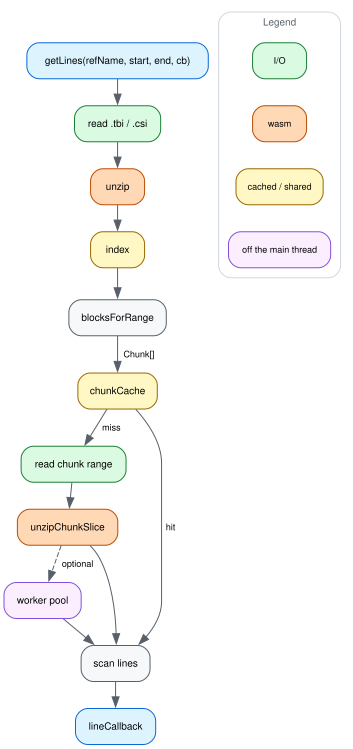

# How a query flows

`getLines` turns a region into a list of BGZF chunks through the index, reads
each chunk through `chunkCache`, and scans the decompressed bytes for lines,
handing the ones that overlap the region to your callback. The header path is
separate — `getLines` never reads it. ([dataflow.dot](img/dataflow.dot) is the
source; see [CONTRIBUTING.md](../CONTRIBUTING.md) for how to re-render it.)

Everything orange is wasm, in
[`@gmod/bgzf-filehandle`](https://github.com/GMOD/bgzf-filehandle), and all of
it is decompressing BGZF blocks — parsing the index and scanning for lines both
stay in JS. Both `.tbi` and `.csi` are bgzip-compressed, so unlike `@gmod/bam`,
where a `.bai` is raw bytes, every index read here goes through it too.

The purple node is opt-in: pass a `bgzfWorkerPool` and chunk decompression moves
off the main thread, and without one the same code runs in-process. Only the
decompression moves, not the line scan, which is why it is one node on a dashed
edge — the same pool, and the same `@gmod/bgzf-filehandle`, that
[bam-js](https://github.com/GMOD/bam-js/blob/main/docs/dataflow.md) takes.

The diagram is the main path only. It leaves out the header reads, the
read-ahead window that decides how far ahead of the scan to fetch, and the
plain-gzip fallback `unzip` takes for non-BGZF input. The first two are in
[optimizations.md](optimizations.md), which explains why each step of this path
looks the way it does.
